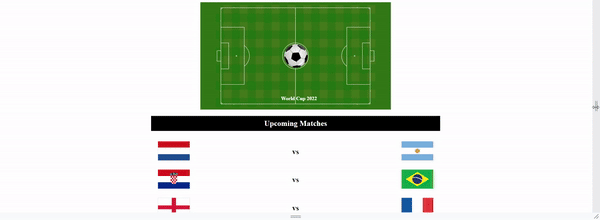

# Responsive-Web-Bootcamp---Web-Foundations---CAD-2024

This repository has the entire code for the Responsive Web Bootcamp of the Web Foundations course which is part of the Computer Application Development program at Conestoga College , 2024.

## Contributors:

[Contributors](contributors.md)

## License & copyright

© Manu Mathew

Licensed under the [MIT License](LICENSE)
